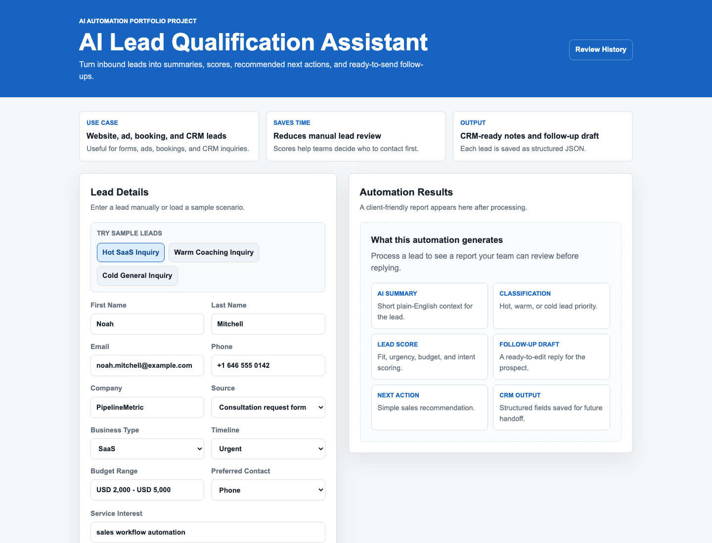
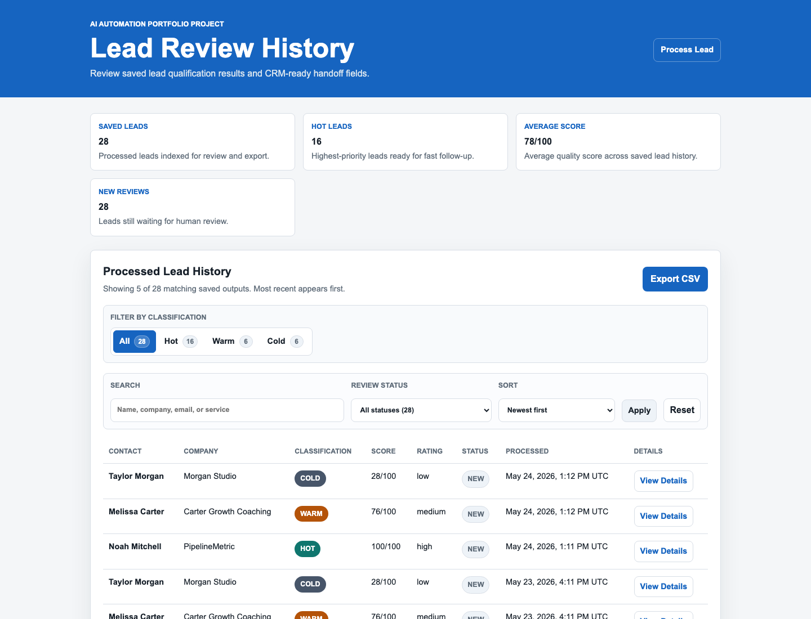
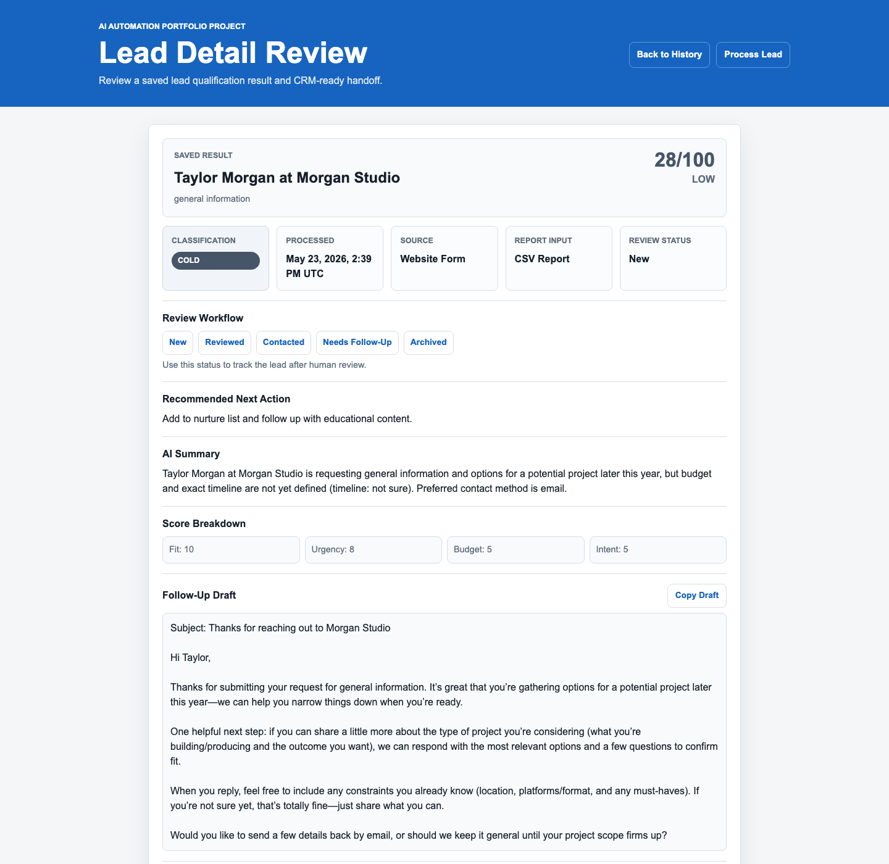

# AI Lead Intake Automation System

AI automation portfolio project that processes inbound leads, summarizes business needs, classifies lead quality, calculates a lead score, drafts a follow-up message, and saves the result for review or future CRM integration.

## Portfolio Summary

**Project name:** AI Lead Intake Automation System

**Repository name:** `ai-lead-automation-lab`

**Short description:** AI automation system that processes leads, summarizes intent, scores quality, drafts follow-up messages, stores CRM-ready outputs, and provides a review dashboard with SQLite-backed status tracking, AI metadata, audit events, CSV export, live Google Sheets append support, operations readiness checks, privacy-aware review controls, OpenAI retry/backoff handling, and structured request observability.

**Target role:** AI Automation Specialist / AI Automation Developer

**Target clients and employers:** agencies, consultants, coaches, SaaS businesses, real estate teams, e-commerce businesses, appointment-based businesses, and service companies hiring remote Filipino AI automation talent.

## Business Problem

Many businesses receive leads from forms, messages, ads, emails, or booking pages. Teams often spend too much time manually reading each lead, deciding whether it is worth pursuing, writing notes, and drafting follow-up messages.

This project shows how AI automation can reduce that manual work while still keeping the final output reviewable by a human.

## What This Project Does

The workflow can:

1. Load lead data from JSON or receive it through a FastAPI webhook.
2. Validate required lead fields.
3. Use the OpenAI API to summarize the lead.
4. Use the OpenAI API to classify the lead as `hot`, `warm`, or `cold`.
5. Generate a rule-based lead score using fit, urgency, budget, and intent.
6. Use the OpenAI API to draft a personalized follow-up message.
7. Save the full automation output locally as JSON.
8. Index saved leads in SQLite for status tracking, history review, and faster querying.
9. Flatten the result into CRM-ready fields for handoff.
10. Show saved lead results in a paginated review dashboard with analytics, search, status filters, and sorting.
11. Track human review status such as `new`, `reviewed`, `contacted`, `needs_follow_up`, and `archived`.
12. Apply review status changes in bulk from the history dashboard.
13. Record audit events for lead processing, detail views, status changes, follow-up draft copies, and CSV exports.
14. Store AI processing metadata such as model, workflow version, prompt versions, and generation timestamps.
15. Export saved lead history as CSV.
16. Preview Google Sheets-ready rows and append saved leads to a live Google Sheet when configured.
17. Open a detail review page for each saved lead, including AI summary, score breakdown, follow-up draft, review workflow actions, AI metadata with readable fallbacks, grouped activity timeline, and saved JSON.
18. Show a system status page and detailed health endpoint for storage, SQLite, model, workflow version, and latest activity checks.
19. Mask email and phone data on lead detail pages for privacy-safe portfolio review.
20. Archive saved leads without deleting their audit trail.
21. Retry transient OpenAI API failures with exponential backoff and jitter.
22. Rate-limit inbound lead processing requests to protect API credits on public deployments.
23. Add request IDs to API responses and structured JSON request logs for traceability.
24. Return client-safe AI processing errors while keeping raw provider failures in server logs.
25. Expose the workflow through a terminal command, webhook API, browser interface, history dashboard, detail review page, JSON history API, review status API, bulk review API, archive API, audit event API, CSV export endpoint, Google Sheets preview and append endpoints, and operations readiness endpoints.

## Architecture Overview

```text
Lead source
  ├─ Sample JSON file
  ├─ Browser interface form
  └─ FastAPI webhook
        ↓
Validation and normalization
        ↓
AI processing
  ├─ OpenAI summary
  ├─ OpenAI hot/warm/cold classification
  ├─ Rule-based score breakdown
  └─ OpenAI follow-up draft
        ↓
CRM-ready output builder
        ↓
Local storage and review surfaces
  ├─ Saved JSON output
  ├─ SQLite lead history index
  ├─ Lead review history dashboard
  ├─ Lead detail review page
  ├─ JSON history API
  ├─ Review status API
  ├─ AI processing metadata
  ├─ Audit event timeline
  ├─ CSV export
  ├─ Google Sheets preview and live append
  ├─ Operations readiness checks
  └─ Privacy-safe review controls
```

The workflow logic is shared by the terminal command and FastAPI API, so the same lead-processing pipeline can support local testing, webhook automation, and browser-based review.

## Business Impact

This project models how a business could reduce manual lead review work while keeping a human in control of final outreach.

- Speeds up first-pass lead qualification by summarizing intent and classifying each lead.
- Standardizes scoring with a repeatable fit, urgency, budget, and intent breakdown.
- Gives sales or operations teams a ready-made follow-up draft instead of starting from a blank message.
- Produces CRM-ready fields that can be copied, exported, or passed into an automation platform.
- Keeps an audit trail through saved JSON output, AI metadata, SQLite history records, review statuses, activity timelines, detail pages, CSV export, and handoff-ready integration payloads.
- Helps reviewers handle queues faster with bulk review status and archive actions.
- Adds operational visibility through a status page and detailed health endpoint for storage, database, model, workflow, and latest activity checks.
- Supports privacy-safe review with masked email/phone rendering and archive-with-audit workflow.
- Reduces temporary AI workflow failures with controlled OpenAI retry/backoff handling.
- Protects live deployments from repeated lead-processing submissions with inbound rate limiting.
- Improves debugging and production traceability with request IDs and structured JSON request logs.
- Keeps browser error messages safe for clients by hiding raw AI provider payloads and API-key details.
- Supports common automation entry points such as forms, webhook tools, and future CRM integrations.

## Current Status

Current milestone: **Portfolio-ready product experience**

The core portfolio version is complete. It includes the local terminal workflow, FastAPI webhook endpoint, browser interface page, saved lead history dashboard, detail review page, SQLite-backed status tracking, bulk review actions, AI metadata, audit event timeline, CSV export, Google Sheets handoff previews and live append support, system status checks, masked contact-data review mode, archive workflow, OpenAI retry/backoff handling, inbound lead-processing rate limiting, request IDs, structured JSON request logs, local JSON output storage, pytest tests, and documentation for future n8n, Make.com, and Zapier connections.

Google Sheets is implemented as the first live external integration. Other external integrations such as n8n, Make.com, Zapier, HubSpot, Airtable, Slack, and Gmail are documented or planned as future production upgrades.

Deployment notes are available in [DEPLOYMENT.md](DEPLOYMENT.md).

## Product Walkthrough

1. A lead enters through the browser interface, a JSON file, or a webhook.
2. The workflow validates the lead and sends the relevant details through AI summarization, classification, scoring, and follow-up drafting.
3. The result is saved as a full JSON audit record with model and prompt-version metadata, then indexed in SQLite for review.
4. The history dashboard gives a human reviewer analytics, search, filters, sorting, CSV export, and quick access to each lead.
5. Reviewers can select several leads and bulk-mark them as reviewed, contacted, needing follow-up, or archived.
6. The detail page shows the complete handoff: score, classification, next action, AI summary, follow-up draft, CRM-ready fields, saved JSON, review status actions, and activity timeline.
7. Integration endpoints expose flat spreadsheet rows, Google Sheets append payload previews, and a live Google Sheets append action when credentials are configured.
8. The system status page shows whether storage, SQLite, model configuration, workflow version, and latest activity are ready.
9. Privacy controls let reviewers mask contact data or archive a lead while keeping audit history available.
10. OpenAI summary, classification, and follow-up generation use controlled retries for rate limits and temporary API failures.
11. Public lead processing requests are rate-limited per client before expensive AI calls run.
12. Every API request receives an `X-Request-ID` response header and writes a structured request log entry.

## Product Screenshots

### Lead Intake Workspace



### Lead Review History



### Lead Detail Review



## Tech Stack

- Python
- OpenAI API
- FastAPI
- Uvicorn
- pytest
- python-dotenv
- JSON local storage
- SQLite
- Local logging
- Structured JSON request logging
- Request/correlation IDs
- OpenAI retry/backoff handling
- Inbound lead-processing rate limiting
- CSV export
- Google Sheets handoff payloads and live append support
- Operations status page and health checks
- Privacy masking helpers
- Docker

## Skills Shown

- AI workflow automation
- OpenAI API usage
- Prompt engineering for business workflows
- Lead intake automation
- Lead qualification
- Lead scoring
- AI summarization
- AI classification
- Follow-up email/message generation
- Webhook/API basics
- JSON data processing
- Environment variables and API key management
- AI model and prompt-version traceability
- Error handling
- Logging
- Structured observability
- OpenAI rate-limit and transient error handling
- Public endpoint rate limiting
- Request ID propagation
- Local output storage
- SQLite persistence
- FastAPI endpoint design
- Simple lead intake workspace design
- Saved lead review history
- Lead detail review UI
- Review status workflow
- Bulk review queue operations
- Audit event logging
- Search, filtering, sorting, and analytics UI
- CRM-ready handoff fields
- CSV reporting/export
- Google Sheets integration handoff design and live append implementation
- Operations readiness checks
- Deployment health endpoint design
- Privacy-safe UI rendering
- Archive workflow with audit trail
- Basic automated testing
- Client-friendly documentation
- n8n, Make.com, and Zapier integration planning

## Project Structure

```text
ai-lead-automation-lab/
├── app/
│   ├── api.py
│   ├── config.py
│   ├── lead_intake_page.py
│   ├── main.py
│   ├── operations.py
│   ├── privacy.py
│   ├── rate_limiter.py
│   ├── integrations/
│   │   └── google_sheets.py
│   ├── static/
│   │   ├── lead-intake.css
│   │   └── lead-intake.js
│   ├── templates/
│   │   └── lead_intake.html
│   └── automation/
│       ├── classifier.py
│       ├── lead_loader.py
│       ├── logger.py
│       ├── message_generator.py
│       ├── openai_client.py
│       ├── scorer.py
│       ├── storage.py
│       ├── summarizer.py
│       └── workflow.py
├── data/
│   ├── leads/
│   └── outputs/
├── docs/
│   └── screenshots/
├── integrations/
│   ├── google_sheets/
│   ├── make/
│   ├── n8n/
│   └── zapier/
├── logs/
├── tests/
├── .env.example
├── .gitignore
├── .dockerignore
├── Dockerfile
├── docker-compose.yml
├── DEPLOYMENT.md
├── requirements.txt
└── README.md
```

## Key Files

`app/main.py` is the terminal entry point.

`app/api.py` exposes FastAPI endpoints:

- `GET /`
- `GET /lead-intake`
- `GET /system-status`
- `GET /history`
- `GET /history/{file_name}`
- `GET /history/{file_name}?privacy=masked`
- `GET /history/export.csv`
- `GET /health/details`
- `GET /api/history`
- `POST /api/history/bulk-status`
- `GET /api/history/{file_name}`
- `GET /api/history/{file_name}/events`
- `GET /api/integrations/google-sheets/preview`
- `GET /api/integrations/google-sheets/preview/{file_name}`
- `POST /api/history/{file_name}/status`
- `POST /api/history/{file_name}/archive`
- `POST /api/history/{file_name}/events`
- `GET /health`
- `POST /webhooks/leads`

`app/lead_intake_page.py` loads the browser interface HTML template.

`app/operations.py` builds detailed health checks and renders the system status page.

`app/privacy.py` masks direct lead contact fields for privacy-safe review views.

`app/rate_limiter.py` protects expensive lead-processing requests with a configurable in-memory rate limiter.

`app/templates/lead_intake.html` contains the browser interface page markup.

`app/static/lead-intake.css` contains the browser interface styling.

`app/static/lead-intake.js` contains the browser interface sample lead and result rendering behavior.

`app/automation/workflow.py` contains the shared workflow used by both the terminal command and FastAPI API.

`app/automation/lead_loader.py` loads and validates lead JSON.

`app/automation/summarizer.py` summarizes lead details using the OpenAI API.

`app/automation/classifier.py` classifies leads as `hot`, `warm`, or `cold`.

`app/automation/scorer.py` calculates a lead quality score.

`app/automation/message_generator.py` drafts follow-up messages using the OpenAI API.

`app/automation/openai_client.py` centralizes OpenAI client creation, timeout settings, retry decisions, exponential backoff, jitter, and structured retry logs.

`app/automation/storage.py` saves processed outputs as JSON, indexes saved leads in SQLite, updates single and bulk review statuses, records audit events, and builds CSV exports.

`app/automation/logger.py` writes local workflow logs and structured JSON events.

`app/integrations/google_sheets.py` builds flat spreadsheet rows and Google Sheets append payload previews from saved lead results.

`data/leads/` contains sample lead JSON files.

`data/outputs/` stores generated local output files.

`integrations/` documents Google Sheets, n8n, Make.com, and Zapier workflow handoffs.

`tests/` contains pytest tests.

## Setup

Create and activate a virtual environment:

```bash
python3 -m venv .venv
source .venv/bin/activate
```

Install dependencies:

```bash
python3 -m pip install -r requirements.txt
```

Create your local environment file:

```bash
cp .env.example .env
```

Add your OpenAI API key to `.env`:

```text
OPENAI_API_KEY=your_api_key_here
OPENAI_MODEL=gpt-5.4-nano
OPENAI_MAX_RETRIES=3
OPENAI_RETRY_BASE_SECONDS=1
OPENAI_TIMEOUT_SECONDS=30
LEAD_PROCESS_RATE_LIMIT_PER_MINUTE=3
LEAD_PROCESS_RATE_LIMIT_WINDOW_SECONDS=60
APP_ENV=development
WORKFLOW_VERSION=lead-intake-v1
SUMMARY_PROMPT_VERSION=summary-v1
CLASSIFICATION_PROMPT_VERSION=classification-v1
FOLLOW_UP_PROMPT_VERSION=follow-up-v1
```

Do not commit `.env` to GitHub.

## Run With Docker

Build and start the product:

```bash
docker compose up --build
```

Open the lead intake workspace:

```text
http://127.0.0.1:8000/lead-intake
```

Open the saved lead review dashboard:

```text
http://127.0.0.1:8000/history
```

Open the system status page:

```text
http://127.0.0.1:8000/system-status
```

Stop the container:

```bash
docker compose down
```

The Docker setup mounts these local folders into the container so generated data persists between runs:

- `data/outputs/` for saved JSON outputs and the SQLite index
- `logs/` for application logs

For hosted deployment notes, see [DEPLOYMENT.md](DEPLOYMENT.md).

## Run The Terminal Workflow

Run the default sample lead:

```bash
python3 -m app.main
```

Run a specific lead file:

```bash
python3 -m app.main --lead-file data/leads/lead_004_saas.json
```

Run with a custom output folder:

```bash
python3 -m app.main --lead-file data/leads/lead_004_saas.json --output-dir data/outputs
```

Example output:

```text
AI Lead Intake Automation System
Lead file: data/leads/lead_004_saas.json
Loaded lead: lead_004
Business type: saas
Contact: Noah Mitchell
Company: PipelineMetric
Interest: sales workflow automation
Status: Lead data loaded and validated successfully.

AI Summary:
The lead is a SaaS company interested in sales workflow automation...

AI Classification:
hot

Lead Score:
100/100 (high)
Breakdown: fit=25, urgency=25, budget=25, intent=25

Follow-Up Message Draft:
Subject: Helping PipelineMetric qualify inbound requests faster

Saved Output:
data/outputs/lead_004_20260522T134038Z.json
```

## Run The FastAPI Webhook API

Start the API server:

```bash
uvicorn app.api:app --reload
```

Open the browser interface:

```text
http://127.0.0.1:8000/lead-intake
```

The lead intake page lets a user enter lead details, click **Process Lead**, and view:

- AI summary
- Hot/warm/cold classification
- Lead score and rating
- Score breakdown
- Follow-up message draft
- Saved output path
- Link to the saved lead detail review page

Open the saved lead review history:

```text
http://127.0.0.1:8000/history
```

The history page reads saved lead records from the SQLite index, with saved JSON output files kept as the audit trail. It shows:

- Processed time
- Contact and company
- Hot/warm/cold classification
- Lead score and rating
- Human review status
- Link to each saved lead detail page

The history page shows 5 leads per page and includes page-number pagination, analytics cards, hot/warm/cold filters, review status filters, search, sorting, bulk status actions, bulk archive action, and a CSV export button.

Export saved lead history as CSV:

```text
http://127.0.0.1:8000/history/export.csv
```

Open a saved lead detail page:

```text
http://127.0.0.1:8000/history/{saved_output_file_name}.json
```

The detail page shows:

- Lead score, rating, source, and report input
- Review status actions for human workflow tracking
- Privacy mode toggle for masking email and phone details
- Archive action that preserves audit history
- Grouped activity timeline for audit events
- Recommended next action
- AI summary
- Score breakdown
- Copyable follow-up draft
- CRM-ready fields
- AI processing metadata with fallback values when older records do not include model or prompt data
- Saved JSON output for audit/review

History is also available as JSON:

```text
http://127.0.0.1:8000/api/history
```

Update a saved lead review status through the API:

```bash
curl -X POST http://127.0.0.1:8000/api/history/{saved_output_file_name}.json/status \
  -H "Content-Type: application/json" \
  -d '{"review_status":"contacted"}'
```

Update several saved leads through the bulk review API:

```bash
curl -X POST http://127.0.0.1:8000/api/history/bulk-status \
  -H "Content-Type: application/json" \
  -d '{"file_names":["lead_one.json","lead_two.json"],"review_status":"reviewed"}'
```

Read audit events for a saved lead:

```text
http://127.0.0.1:8000/api/history/{saved_output_file_name}.json/events
```

Open the operations status page:

```text
http://127.0.0.1:8000/system-status
```

Read detailed health checks as JSON:

```text
http://127.0.0.1:8000/health/details
```

Open a saved lead detail page with masked contact data:

```text
http://127.0.0.1:8000/history/{saved_output_file_name}.json?privacy=masked
```

Archive a saved lead while preserving the audit trail:

```bash
curl -X POST http://127.0.0.1:8000/api/history/{saved_output_file_name}.json/archive
```

Preview all saved leads as Google Sheets-ready rows:

```text
http://127.0.0.1:8000/api/integrations/google-sheets/preview
```

Preview one saved lead as a Google Sheets append payload:

```text
http://127.0.0.1:8000/api/integrations/google-sheets/preview/{saved_output_file_name}.json
```

Append one saved lead to the configured live Google Sheet:

```bash
curl -X POST http://127.0.0.1:8000/api/integrations/google-sheets/append/{saved_output_file_name}.json
```

Open the interactive API docs:

```text
http://127.0.0.1:8000/docs
```

Health check:

```bash
curl http://127.0.0.1:8000/health
```

Every API response includes an `X-Request-ID` header. You can provide your own request ID for correlation:

```bash
curl http://127.0.0.1:8000/health \
  -H "X-Request-ID: portfolio-check-001"
```

Process a lead through the webhook endpoint:

```bash
curl -X POST http://127.0.0.1:8000/webhooks/leads \
  -H "Content-Type: application/json" \
  -d @data/leads/lead_004_saas.json
```

## Output Format

Each successful run saves a JSON file in `data/outputs/`.

The application also maintains a local SQLite index at:

```text
data/outputs/lead_intake.db
```

The SQLite index stores compact lead history fields, review status, and activity events, while JSON files remain the full audit record.

The saved output includes:

- Processing timestamp
- Original lead data
- AI-generated summary
- AI lead classification
- Lead score and score breakdown
- AI-generated follow-up message draft
- CRM-ready flattened output for future spreadsheet, CRM, or automation platform handoff
- AI metadata: model, workflow version, prompt versions, and generation timestamps
- OpenAI retry/backoff behavior for rate limits and temporary failures
- Inbound rate-limit headers for public lead processing
- Review status when a lead has been updated by a reviewer
- Bulk review updates for selected saved leads
- Privacy-safe masked display support for email and phone review
- Archived status when a lead is removed from active follow-up queues
- Activity events for processing, viewing, copying, export, and status changes
- Google Sheets-ready handoff fields through integration preview endpoints

Generated `.json` and `.db` output files are ignored by Git because real outputs may contain lead or customer information.

## Sample Leads

The project includes sample lead scenarios for common client conversations:

- `data/leads/sample_hot_saas.json`
- `data/leads/sample_warm_coaching.json`
- `data/leads/sample_cold_general.json`

The browser interface also has quick-fill buttons for hot, warm, and cold examples.

## Tests

Run tests:

```bash
python3 -m pytest
```

The current tests cover:

- API health endpoint
- Browser interface page
- Saved lead history page
- Saved lead detail page
- CSV history export
- Saved lead history API
- SQLite history indexing
- Review status persistence
- Bulk review status persistence
- Audit event recording
- Archive workflow persistence
- Invalid webhook lead validation
- Lead JSON loading
- Missing lead file handling
- Required field validation
- Output result structure
- CRM-ready output structure
- AI metadata output structure
- Local JSON output saving
- Google Sheets row and append payload shape
- Detailed health check and system status page
- Masked contact rendering
- Request ID response headers
- Structured JSON logging helper
- OpenAI retry/backoff helper
- Inbound rate limiter behavior

The tests do not call the OpenAI API, so they run without spending API credits.

## Logs

Logs are written locally to:

```text
logs/app.log
```

Generated `.log` files are ignored by Git.

API requests are logged as structured JSON events inside the application log. Request logs include:

- `event`
- `request_id`
- `method`
- `path`
- `status_code`
- `duration_ms`
- `client_host`

OpenAI retry/backoff events are also logged as structured JSON events. Retry logs include:

- `event`
- `operation`
- `attempt`
- `max_retries`
- `delay_seconds`
- `error_type`

## Integration Notes

The project includes documentation for future automation platform connections:

- [Google Sheets integration notes](integrations/google_sheets/README.md)
- [n8n integration notes](integrations/n8n/README.md)
- [Make.com integration notes](integrations/make/README.md)
- [Zapier integration notes](integrations/zapier/README.md)

These docs explain how each platform could send lead JSON to:

```text
POST /webhooks/leads
```

The Google Sheets notes also document the tested handoff payload and live append endpoint:

```text
GET /api/integrations/google-sheets/preview
GET /api/integrations/google-sheets/preview/{saved_output_file_name}.json
POST /api/integrations/google-sheets/append/{saved_output_file_name}.json
```

## Limitations and Next Steps

This is a portfolio-ready local product preview, not a production SaaS application. The current version is designed to show workflow design, API structure, AI processing, SQLite-backed review workflows, review UI, and exportable outputs.

Production improvements would include:

- Add authentication and role-based access before exposing saved lead data.
- Move from local SQLite to managed PostgreSQL for hosted multi-user use.
- Add another live CRM write integration such as HubSpot, Pipedrive, Airtable, Slack, or Gmail.
- Add background job processing for slow or high-volume AI requests.
- Move inbound rate limiting from in-memory storage to Redis or a managed shared store for multi-instance production.
- Add privacy controls for deleting lead records and masking sensitive fields in logs or screenshots.
- Add configurable retention windows for archived lead records.
- Add an architecture diagram to the README for faster recruiter review.

## Milestone History

1. Project setup
2. Sample lead JSON data
3. Local lead loading and validation
4. OpenAI lead summarization
5. OpenAI hot/warm/cold classification
6. Rule-based lead scoring
7. OpenAI follow-up message draft
8. Local JSON output storage
9. Terminal workflow
10. Error handling and logging
11. pytest tests
12. FastAPI webhook endpoints
13. n8n, Make.com, and Zapier documentation
14. README polish for GitHub portfolio presentation
15. Simple FastAPI browser interface and CRM-ready output block
16. Saved lead review history page and history API
17. CSV export for saved lead history
18. Saved lead detail review page with CRM-ready fields, follow-up draft copy action, and saved JSON audit view
19. Portfolio UI polish for history dashboard, detail page, readable timestamps, and cleaner detail actions
20. README architecture, business impact, and limitations/next-step sections
21. SQLite-backed saved lead index with review status tracking
22. History dashboard analytics, search, status filtering, and sorting
23. Detail-page review workflow actions and review status API
24. Docker support and deployment guide
25. Audit event logging and detail-page activity timeline
26. AI model and prompt-version metadata for saved outputs
27. Google Sheets handoff adapter, preview endpoints, tests, and integration documentation
28. System status page and detailed health endpoint for operations readiness
29. Privacy-safe masked detail view and archive workflow with audit events
30. Bulk history dashboard actions for review status updates and archive workflows
31. Request IDs and structured JSON API request logging
32. OpenAI retry/backoff helper for rate limits and transient API failures
33. Inbound lead-processing rate limiter for public deployment protection
34. Final UI polish for responsive history analytics, wider detail review layout, grouped activity events, and metadata fallback states
35. Client-safe AI error messaging with request references for server-side debugging

## Portfolio Talking Point

This project shows a practical AI automation workflow for businesses that receive inbound leads and need faster qualification, prioritization, queue-based review operations, human review tracking, AI output traceability, auditability, privacy-aware review, follow-up drafting, CSV reporting, spreadsheet-ready handoff, operations visibility, request traceability, rate-limit resilience, safe client-facing error handling, public endpoint protection, and CRM-ready output.

It is intentionally beginner-friendly, but it uses real-world building blocks: structured JSON, OpenAI API calls, prompt-version metadata, validation, scoring logic, FastAPI webhooks, SQLite indexing, audit events, CSV export, Google Sheets handoff payloads, detailed health checks, request IDs, structured request logs, client-safe AI failure messages, OpenAI retry/backoff handling, inbound rate limiting, privacy masking, bulk review actions, archive workflow, logging, tests, and human-review UI screens.
